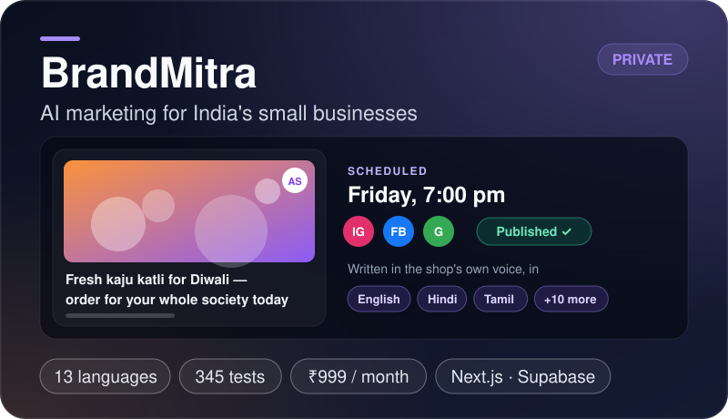
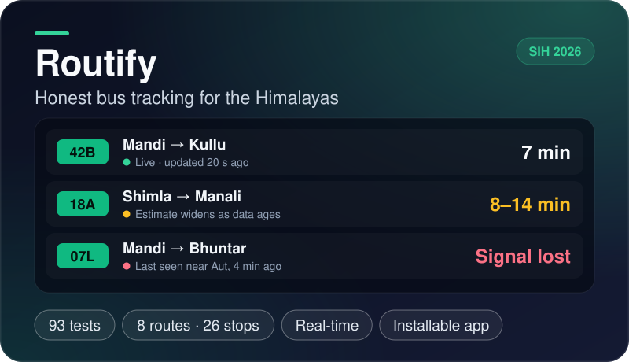
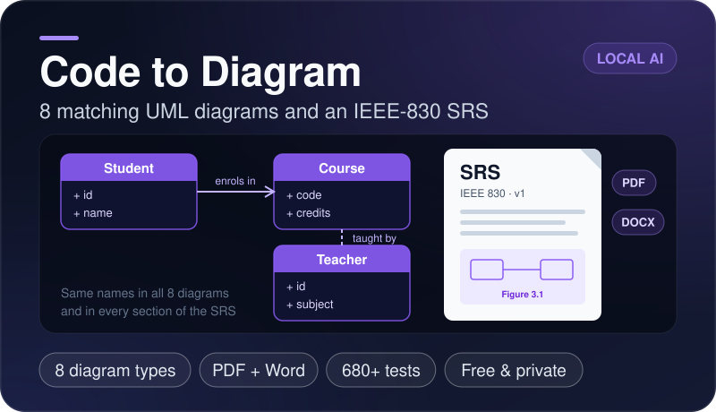
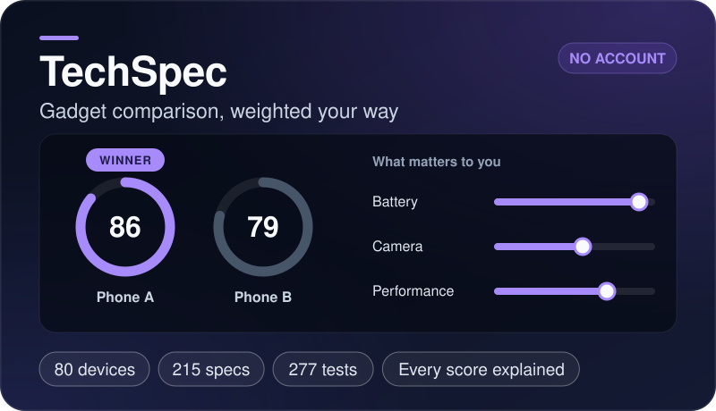
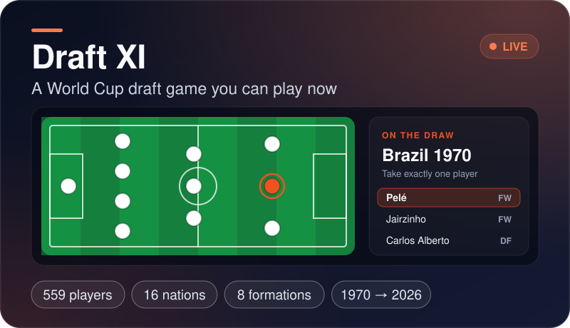
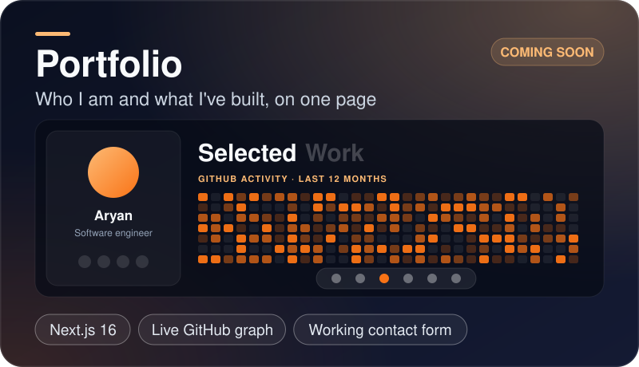

  

  
  
  

 

I'm a Computer Science student who likes building things all the way through — the idea, the code, the tests, and the page that explains it. Right now that means an AI marketing platform for India's small businesses and a bus tracker built for the Himalayas, plus the smaller products below.

 

## Things I've built

  
  

  
  

  
  

Click a card to see the code. BrandMitra's repository is private for now.

 

## What I work with

  

 

## Right now

I'm taking **BrandMitra** from a tested engine to a launched product, and going deeper into system design, cloud and AI along the way. What I care about most: products that solve a real problem, and code that's clean enough for the next person to trust.

 

  <i>"Trust the process."</i> 
  Every bug, failed attempt and finished project is part of becoming a better engineer. Thanks for visiting.

