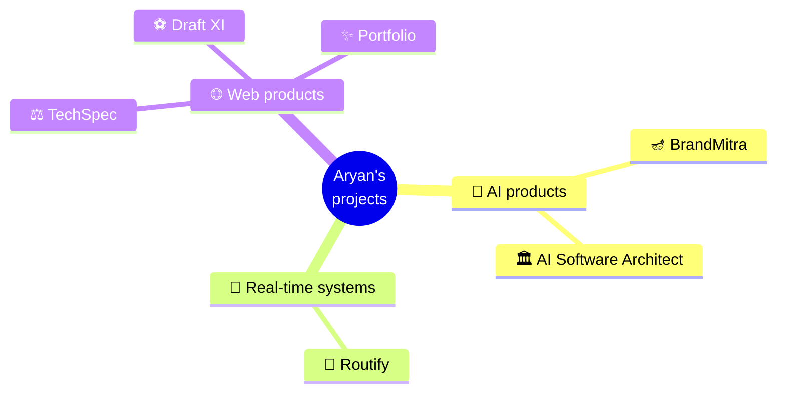

# Hey, I'm Aryan Deshmukh 👋

### Computer Science student and aspiring software engineer — I build complete products that solve real problems

**AI tools, real-time systems and web products — designed, built, tested and documented end to end.**

 

  

  

---

## 👋 In 30 seconds

<table>
<tr>
<td width="22%">

🧑‍💻 **Who I am**

</td>
<td>

A Computer Science student and aspiring software engineer who believes the best way to grow is to **build consistently**. Every project is a chance to learn something new and ship something real.

</td>
</tr>
<tr>
<td width="22%">

🛠️ **What I build**

</td>
<td>

Full products, not just demos: an AI marketing platform for Indian small businesses, a bus tracker for the Himalayas, a local-first AI tool for software documentation, a gadget comparison engine, and a football game that's live on the web.

</td>
</tr>
<tr>
<td width="22%">

✅ **How I build**

</td>
<td>

Automated tests on my larger projects, security designed in from the start, and READMEs that say plainly what works and what doesn't yet.

</td>
</tr>
<tr>
<td width="22%">

🎯 **What drives me**

</td>
<td>

Backend engineering, system design, cloud computing, AI, and building startups and products that make a difference.

</td>
</tr>
</table>

---

## 🗺️ My projects at a glance

---

## 🚀 Featured projects

<table>
<tr>
<td width="50%" valign="top">

### 🪔 BrandMitra
**AI marketing for India's small businesses.** Writes social posts in a shop's own voice in 13 languages, learns from every edit, designs on-brand images, publishes on schedule to Instagram, Facebook and Google, and bills ₹999/month through Razorpay.

`Next.js` `TypeScript` `Supabase` `Gemini` `Inngest` `Razorpay`
 ✅ **345 tests** · 🔒 private repository for now

</td>
<td width="50%" valign="top">

### 🚌 [Routify](https://github.com/AryanDeshmukh-2711/SIH-2026---Smart-vehicle-tracking-)
**Honest bus tracking for the Himalayas.** Arrival times that widen as data ages, six ways to find your stop when GPS fails, a driver app and a depot dashboard.

`React` `Node.js` `PostGIS` `Redis` `MQTT` `Socket.IO`
 ✅ **83 tests** · 🇮🇳 built for SIH 2026

</td>
</tr>
<tr>
<td valign="top">

### 🏛️ [AI Software Architect](https://github.com/AryanDeshmukh-2711/code-to-diagram-app)
**Every diagram and the SRS, all in agreement.** Turns a project description into 8 matching UML/ER diagrams and an IEEE-830 document, as PDF or Word — free and private, with a local AI model.

`FastAPI` `Next.js` `PostgreSQL` `PlantUML` `Ollama` `Docker`
 ✅ **680+ tests**

</td>
<td valign="top">

### ⚖️ [TechSpec](https://github.com/AryanDeshmukh-2711/TechSpec)
**Comparison, weighted your way.** Compare 80 phones, laptops and other gadgets by what matters to *you* — every score explained, value for money mapped, no account needed.

`React` `TypeScript` `Vite` `Tailwind` `Vitest`
 ✅ **277 tests** · CI on every push

</td>
</tr>
<tr>
<td valign="top">

### ⚽ [Draft XI](https://github.com/AryanDeshmukh-2711/draft.xi)
**A World Cup draft game.** Take one real player per turn from squads since 1970, name a bench, and simulate the tournament — with a server-checked leaderboard.

`Next.js` `React` `TypeScript` `Zod` `Vercel`
 ▶️ **[Play it live](https://draftxi-seven.vercel.app/play)** · 559 players

</td>
<td valign="top">

### ✨ [Portfolio](https://github.com/AryanDeshmukh-2711/portfolio)
**Who I am, on one page.** A fixed profile card, live GitHub activity, filterable projects and a working contact form.

`Next.js` `TypeScript` `Tailwind` `Motion` `Resend`
 🔜 launching soon

</td>
</tr>
</table>

---

## 🧰 Tech I work with

**Languages**

   

**Frontend**

   

**Backend and data**

     

**AI**

  

**Tools and deployment**

     

---

## 🌱 What I'm working on

- 💻 Taking **BrandMitra** from a tested engine to a launched product
- ☁️ Learning cloud technologies and scalable architectures
- 🏗️ Deepening my understanding of system design
- 🤖 Exploring AI and modern developer tools

## 🎯 Goals

- Build products that solve real problems
- Write clean, scalable and maintainable code
- Keep learning new technologies every day
- Contribute to meaningful open-source projects
- Grow into a well-rounded software engineer

---

> *"Trust the process."*

Progress doesn't happen overnight. Every bug, failed attempt and finished project is part of becoming a better developer.

**Thanks for visiting — feel free to explore my repositories or [get in touch](mailto:aryandeshmukh2345@gmail.com). Happy coding! 🚀**

